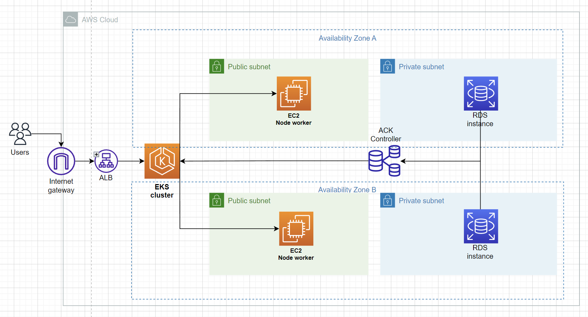
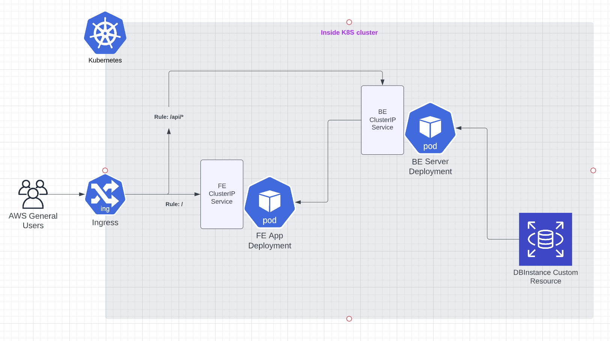

# Udacity Capstone project: K8S-TODO LIST APP
Using AWS, K8S (EKS), cloudformation and circleCI to build it.
## Table of content
1. [Proposal](#1-proposal)
    1. [AWS architecture](#11-aws-architecture)
    2. [K8S cluster](#12-k8s-cluster)
    3. [AWS CICD solution](#13-cicd-process)

## 1. Proposal
#### 1.1 AWS architecture
- Using VPC, Subnet, SG, EKS, RDS, Cloudformation
- Diagram: [AWS architect](https://drive.google.com/file/d/1_pf1YazunItCWiglUYWUB5rYrgsa0x8w/view?usp=sharing)
- images: 

#### 1.2 K8S cluster
- Building with kubectl, eksctl, ansible
- Diagram: [Cluster architect](https://lucid.app/lucidchart/7e408833-ad30-4c35-b2bf-86e505d4a393/edit?viewport_loc=107%2C16%2C1298%2C609%2CSYPVJmZVJ.iM&invitationId=inv_35fdec7b-31d7-45bd-8a5e-9b5003ff6224)
- images: 
 

#### 1.3 CI/CD process
- Using CircleCI
- Diagram: [CICD architect](https://drive.google.com/file/d/1_pf1YazunItCWiglUYWUB5rYrgsa0x8w/view?usp=sharing)
- images: 
