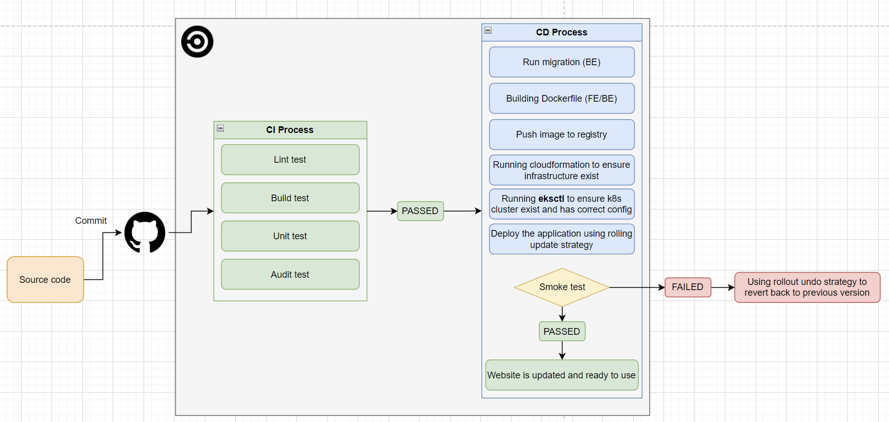

# Udacity Capstone project: K8S-TODO LIST APP
Using AWS, K8S (EKS), cloudformation and circleCI to build it.
## Table of content
1. [Proposal](#1-proposal)
    1. [AWS architecture](#11-aws-architecture)
    2. [K8S cluster](#12-k8s-cluster)
    3. [AWS CICD solution](#13-cicd-process)

## 1. Proposal
#### 1.1 AWS architecture
- Using VPC, Subnet, SG, EKS, RDS, Cloudformation
- Diagram: [AWS architect](https://drive.google.com/file/d/1_pf1YazunItCWiglUYWUB5rYrgsa0x8w/view?usp=sharing)
- images: 


#### 1.2 K8S cluster
- Building with kubectl, eksctl, ansible
- Diagram: [Cluster architect](https://lucid.app/lucidchart/7e408833-ad30-4c35-b2bf-86e505d4a393/edit?viewport_loc=107%2C16%2C1298%2C609%2CSYPVJmZVJ.iM&invitationId=inv_35fdec7b-31d7-45bd-8a5e-9b5003ff6224)
- images: 
 

#### 1.3 CI/CD process
- Using CircleCI
- Diagram: [CICD architect](https://drive.google.com/file/d/1_pf1YazunItCWiglUYWUB5rYrgsa0x8w/view?usp=sharing)
- images: 

## 2 Pre-setup 
Before we bring the CICD pipeline we need to presetup the infra

#### 2.1 Prepare network infra by running: 
```sh
# Create infra
IaC/script/deploy-network.sh create false

# Update infra
IaC/script/deploy-network.sh udpate false
```

#### 2.2 Prepare eks cluster (AWS cluster) by running: 
```sh
# Create infra
IaC/script/deploy-eks.sh create false

# Update infra
IaC/script/deploy-eks.sh update false
```

#### 2.3 Running the project locally: 
 1. You need to install kubectl using Docker Desktop or minikube
   ```sh
   # Create secret using kubectl name DB_PASSWORD
   kubectl create secret generic database-credential --from-literal DB_PASSWORD=abc
   ```
 2. Running everything up using: `kubectl apply -f k8s/local`
 3. Change your /etc/host file to point local-capstone.com to 127.0.0.1
 4. After running the project success fully you can run kubectl get pods to check 
 if there are 2 deployemnts todo-be and todo-fe
 5. Go to local-capstone.com and enjoy the result

#### 2.4 Deploy to EKS
 1 .You have to install and config IAM role for ACK using this instruction: https://aws-controllers-k8s.github.io/community/docs/user-docs/install/
```sh
# Create secret using kubectl name DB_PASSWORD
kubectl create secret generic database-credential --from-literal DB_PASSWORD=abc
```
 => You need to update your kubeconfig file using this instruction in order to connect EKS cluster: `aws eks update-kubeconfig --region region-code --name my-cluster`
 2. Install rds using this instruction: https://aws-controllers-k8s.github.io/community/docs/tutorials/rds-example/ (Sometimes **ACK** is not stable so instead of using ACK you still can create it manually and push DB credential to Configmap named **rds-configmap**)
 
 3. By this way, we are able to create RDS via k8s cluster (EKS). 
 4. Go to your cloudformation output to check and change the value insde file `k8s/prod/db-instance.yml`
 5. Deploy everything to EKS by using `kubectl apply -f k8s/prod`
 6. install ingress-nginx using this instruction: https://kubernetes.github.io/ingress-nginx/deploy/#aws
 7. Deploy ingress controller using `kubectl apply -f ingress.yml`
 8. You will reveive a load-balancer link: 
 
 in my case: [a0d120f18bc6b4653b9f5013cf30053e-6c146ae369ac8bdc.elb.us-east-1.amazonaws.com]
 9. I bought a cheap domain named **schoolx.host** and add an CNAME to it so from now we can use schoolx.host to refer to LB domain above. To see how the website look like: <a href="project-brochure.md">Project brochure</a>