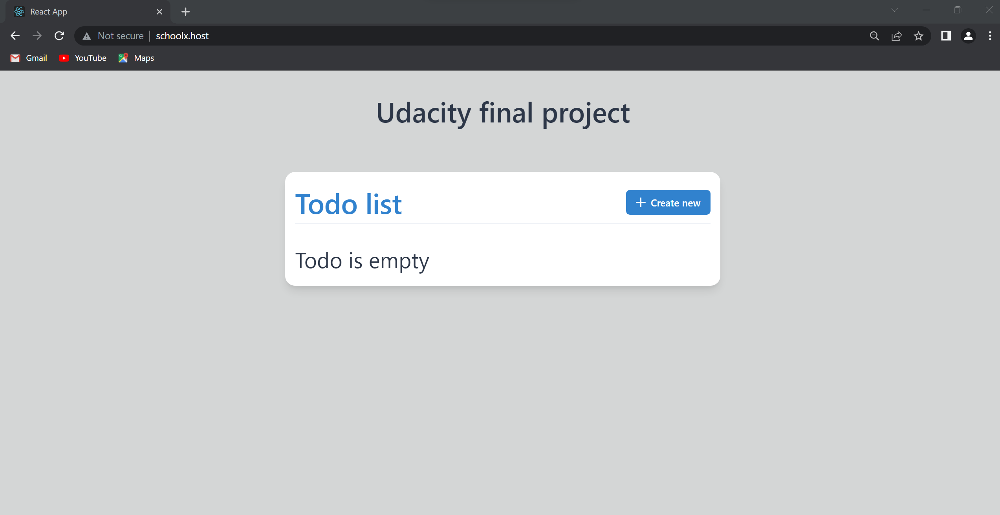
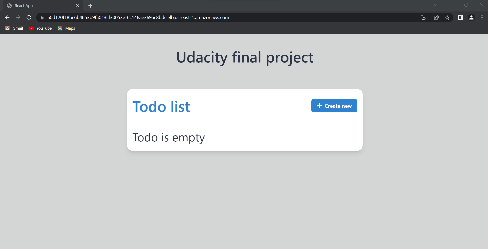
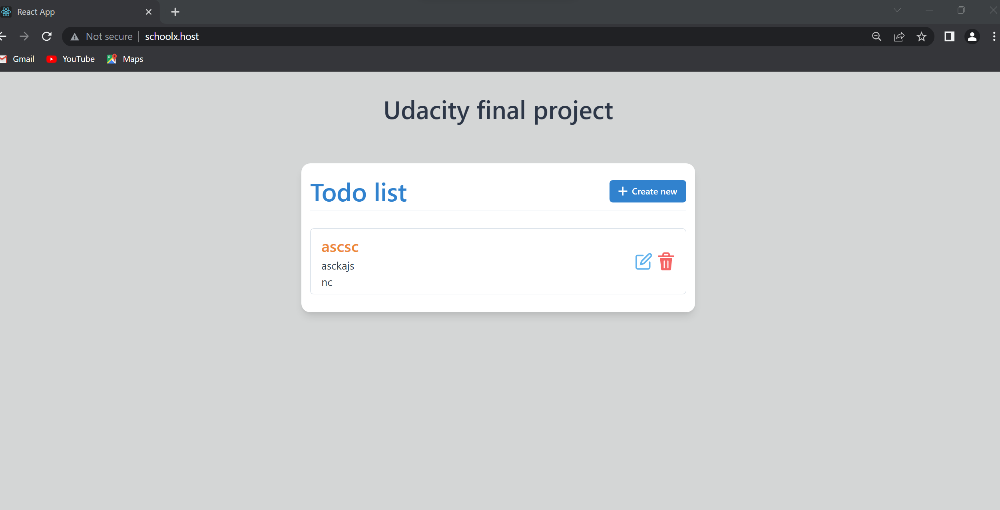

### 1. After our app is online, here's the result: 
a. Using domain: schoolx.host
 
b. Using dns from aws
 
**Note: Because I use schoolx.host domain for fe app, so to use full functionality we should use the domain**

 
 It seems every thing work as expect

### CICD Images

 
