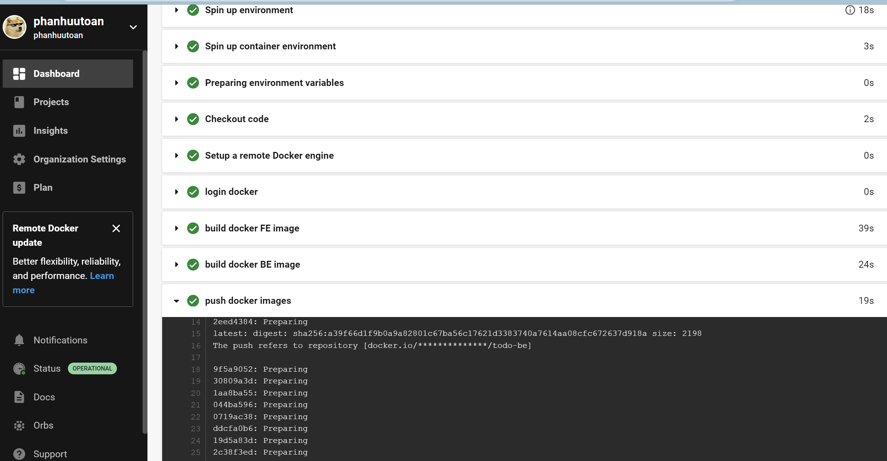
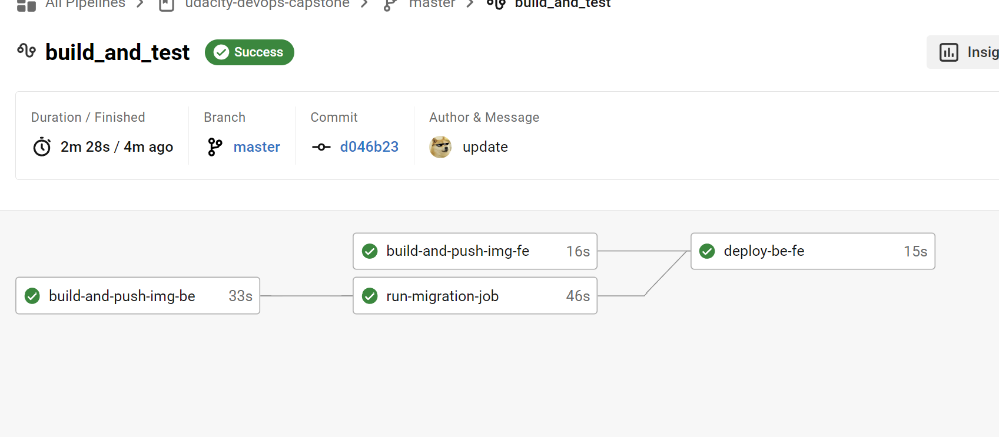
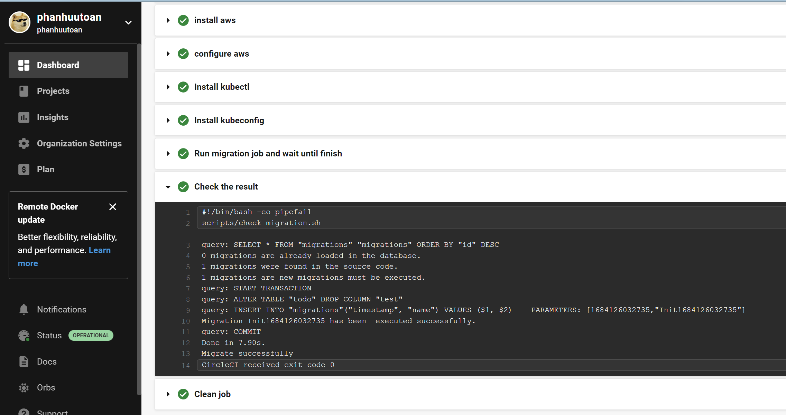
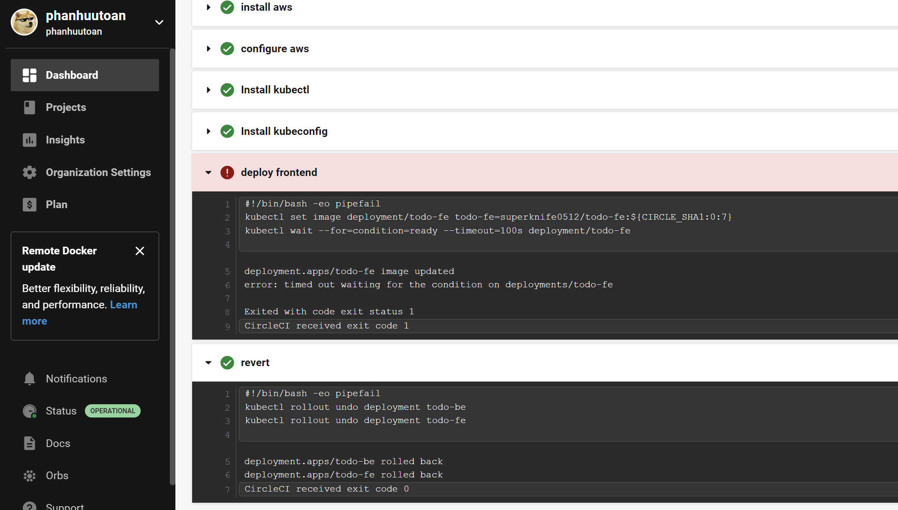
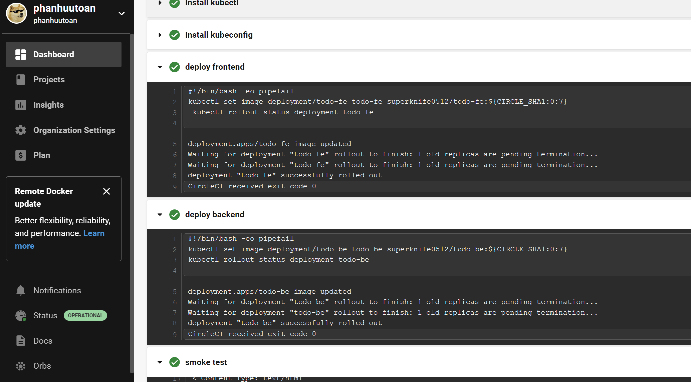
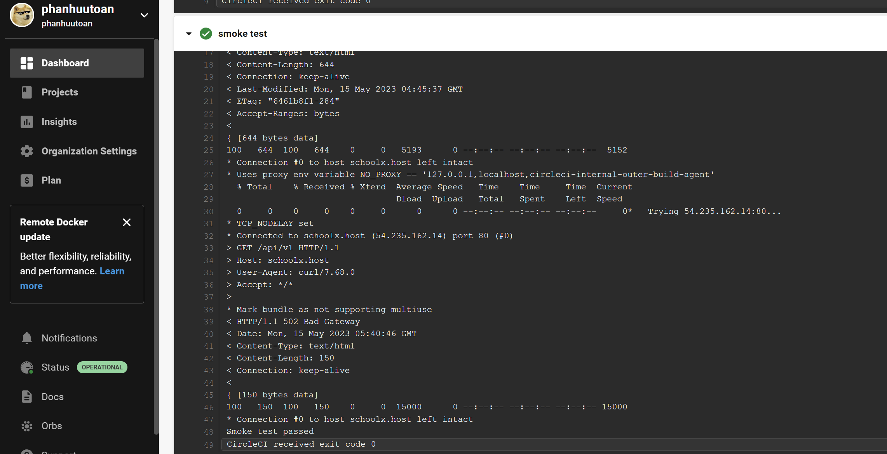
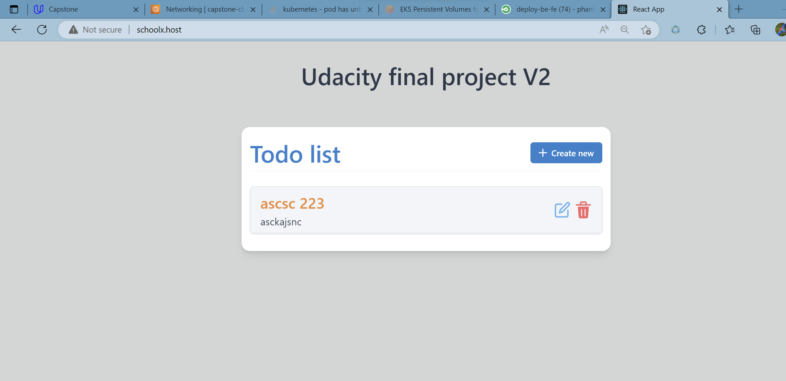

## 1. After our app is online, here's the result, CI process
a. Using domain: schoolx.host
 
b. Using dns from aws
 
**Note: Because I use schoolx.host domain for fe app, so to use full functionality we should use the domain**

 
 It seems every thing work as expect

### CICD Images
1. In the first time we run the CICD it seems like everything would fail as images below:
##### Lint failed: 
 

##### UT failed (BE/FE)
 
 

 ##### Pipeline failed after fixing lint
 

 ##### Pipeline success when fix UT
 

 ## 2. CD process: 

##### Docker build and push successfully
 
 

##### Migration via k8s cluster because I use private RDS DB
 

##### Deploy app failed and run revert
 

##### Deploy app successfully and passed smoke test
 
 

##### It seems like our app update successfully
 

 

 
